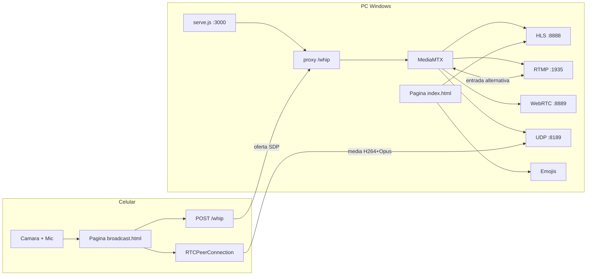
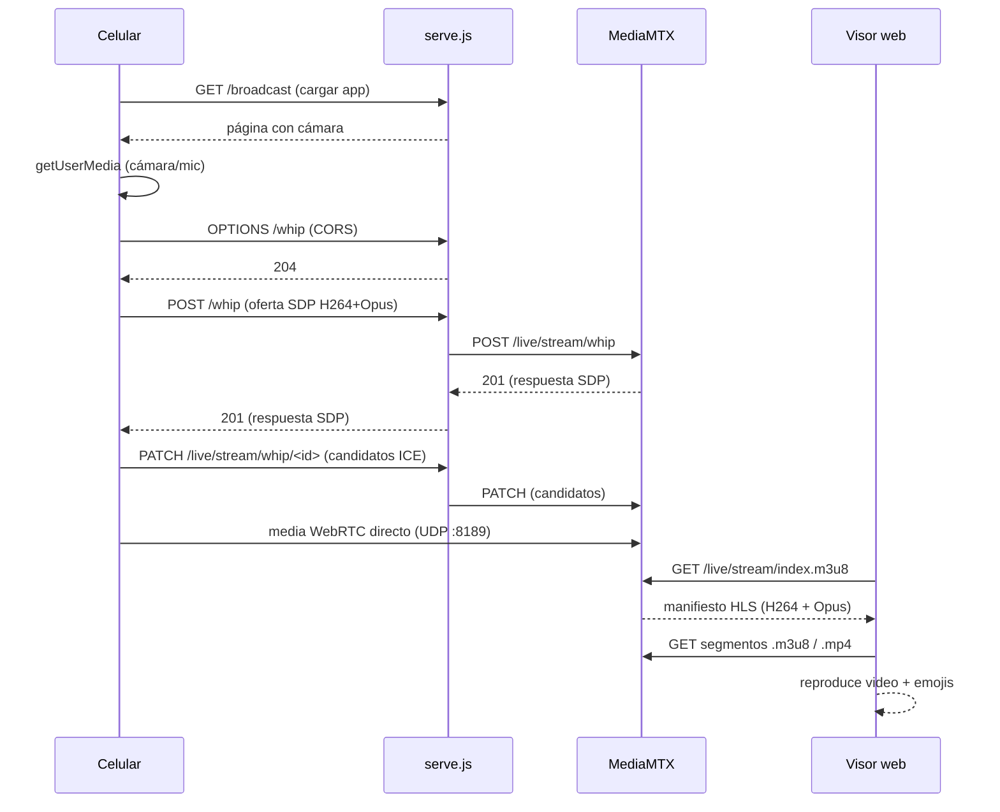

# TikTok LIVE Vertical — Sistema de emisión y visualización

Sistema completo para emitir video **vertical** desde el celular y mostrarlo en una web con **emojis animados encima** y **delay configurable**.

```
celular ──► MediaMTX ──► HLS ──► Página web (visor)
   │           │                       │
   └─ WebRTC/WHIP                      └─ hls.js + emojis + delay
```

---

## 1. ¿Qué hace cada pieza?

### MediaMTX (el servidor de medios)
Un binario que recibe el video del celular y lo redistribuye. Habla varios protocolos y los convierte entre sí **sin recodificar** (remux).

| Puerta | Protocolo | Uso |
|--------|-----------|-----|
| `:1935` | RTMP | Entrada clásica (Larix, OBS, apps RTMP) |
| `:8889` | WebRTC / WHIP | Entrada desde el navegador del celular |
| `:8888` | HLS | Salida que reproduce la web |
| `:8554` | RTSP | Entrada/salida RTSP |
| `:8189` | WebRTC (UDP/ICE) | Tráfico media de WebRTC |

Config: `mediamtx.yml`

### broadcast.html — "nuestra app de emisión" (celular)
Página web que usa la cámara del celular y la publica por **WHIP** (WebRTC):

```
cámara + mic (getUserMedia)
        │
        ▼
RTCPeerConnection  ──►  POST oferta SDP (WHIP)
        │                         │
        │              serve.js:3000/whip ──proxy──► MediaMTX:8889
        │                                              │
        └─────── media (H264 + Opus) por UDP:8189 ─────┘
```

### serve.js — el servidor web local
- Sirve las páginas (`/`, `/broadcast`)
- **Proxy WHIP**: recibe el `POST /whip` del celular y lo reenvía a MediaMTX (resuelve CORS/trickle-ICE por puertos distintos)
- Sirve `hls.js` y `publisher.js`
- Loguea accesos (`acceso.log`) y errores del navegador (`errores.log`)

### index.html — el visor
- Reproduce el HLS con **hls.js**
- **Delay configurable** (`liveSyncDuration`) para atrasar el video respecto al directo
- **Lluvia de emojis** encima (pool fijo de nodos, pausa en pestaña oculta)
- Pantalla completa + activar sonido con un toque

---

## 2. Diagrama de arquitectura



## 3. Secuencia de una transmisión



---

## 4. Cómo se usa

### Levantar todo
Doble clic en **`iniciar.cmd`** (abre MediaMTX y la web en ventanas propias) o `detener.cmd` para apagarlo.

### Transmitir desde el celular
1. En el Chrome del celular, activa el flag para permitir cámara en `http://`:
   `chrome://flags/#unsafely-treat-insecure-origin-as-secure`
   → agregar `http://<IP-de-la-PC>:3000` (y `:8889`)
2. Abre `http://<IP-de-la-PC>:3000/broadcast`
3. Da permiso a cámara/mic, toca **TRANSMITIR**.
   (O usa una app RTMP como Larix en `rtmp://<IP>:1935/live` con stream name `stream`)

### Ver
Abre `http://localhost:3000` en la PC.

### Configurar `.env`
```
STREAM_URL=http://localhost:8888/live/stream/index.m3u8
VIDEO_DELAY=5        # segundos de retraso
EMOJIS=["🔥","😍"]   # emojis de la lluvia
MAX_EMOJIS=10
```
Sobreescritura en caliente: `?delay=8`, `?max=15`, `?src=...`

---

## 5. Puertos y red

| Puerto | Protocolo | Firewall |
|--------|-----------|----------|
| 1935 | TCP RTMP | abierto |
| 8888 | TCP HLS | abierto |
| 8889 | TCP WebRTC/WHIP | abierto |
| 8189 | UDP WebRTC/ICE | abierto |
| 3000 | TCP página web | abierto |

Ejecutar `abrir-puertos.cmd` **como administrador** para abrirlos.

---

## 6. Lecciones aprendidas (cómo llegamos aquí)

1. **vdo.ninja en iframe** no sirve de fondo fiable: bloquea autoplay con audio, muestra su homepage y no da acceso a los pixeles. → Cambiamos a un servidor local de medios.
2. **Larix (RTMP)** funciona pero pone marca de agua "test stream" en el modo demo (pago).
3. El navegador **bloquea la cámara sobre `http://`** (requiere contexto seguro) → se resuelve con el flag de Chrome o HTTPS.
4. **Bug `""`**: el endpoint WHIP quedaba como el string literal `""` porque se inyectaba `JSON.stringify('')` y la comprobación lo trataba como URL válida → el fetch pedía `/%22%22`.
5. **Proxy WHIP**: la señalización WebRTC (POST + PATCH trickle-ICE) debe pasar por el mismo origen (3000) porque el navegador no mezcla puertos; si el PATCH no se proxya, ICE nunca conecta ("deadline exceeded").
6. **VP8 no va a HLS**: Chrome por defecto usa VP8, pero HLS exige H264 → hay que forzar H264 con `transceiver.setCodecPreferences()`. (`codecs` en `addTransceiver` NO funciona en Chrome).
7. **B-frames rompen el muxer HLS**: si el H264 usa perfil Main/High (con B-frames), MediaMTX muere con "unable to extract DTS: too many reordered frames" y el visor recibe 500/401. → Forzar **perfil Baseline** (familia `profile-level-id=42`: `42001f`/`42e01f`, sin B-frames). Ojo: hay que aceptar TODA la familia `42`, no solo `42e01f`.
8. **Apagar el mic con `track.enabled=false` rompe el stream**: detiene los paquetes de audio del WebRTC → el track de audio de MediaMTX se queda sin datos → el muxer HLS falla. → Para "silenciar" hay que **reemplazar el track por uno de silencio** (`sender.replaceTrack(trackSilencioso)`), manteniendo el audio vivo. (También evita el loopback).
9. **La cámara no debe activarse al cargar la página** de emisión: se activa bajo demanda (pulsar TRANSMITIR) para no sorprender con la webcam de la PC.
10. **Refresh duro**: agregar botón que recargue con `?v=timestamp` para evitar cachés viejas del celular.

---

## 7. Archivos

```
lives/
├── mediamtx.yml        # Config de MediaMTX (puertos, paths)
├── serve.js            # Servidor web + proxy WHIP + logs
├── index.html          # Visor: HLS + emojis + delay
├── broadcast.html      # App de transmisión (celular)
├── publisher.js        # Cliente WHIP oficial de MediaMTX
├── index.js            # (experimento previo) tiktok-live-connector
├── iniciar.cmd         # Levanta MediaMTX + web
├── detener.cmd         # Apaga todo
├── web.cmd             # Solo levanta la web
├── reiniciar-web.cmd   # Reinicia la web
├── abrir-puertos.cmd   # Firewall (admin)
├── .env                # Configuración (no se sube)
└── .env.example        # Plantilla de configuración
```
